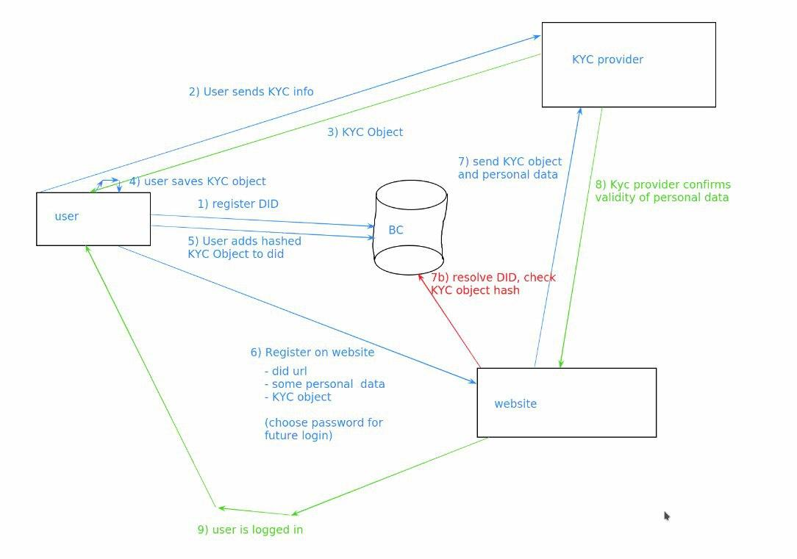

# First Proof of concept

In this folder you can find everything you need in order to run the proof of concept.



In this image the following are mentioned:

- DID: Decentralised identifier.
- User: The user local data.
- BC: This is the blockchain, in this case we choose substrate.
- KYC providor: A KYC provider that will verify the user's credentials.
- Website: A third party website that will let a user register using KYC verified credentials and a DID.

## DID

DID or decentralised identifier, in this case it looks like this:

`did:tf:substrate_address`

We don't generate the DID in this example but we rather infer the DID from the user's public address. 

In this example the user is called *Alice* and has an address on the blockchain with some tokens. The public address is *5GrwvaEF5zXb26Fz9rcQpDWS57CtERHpNehXCPcNoHGKutQY*, this means the DID is:

`did:tf:5GrwvaEF5zXb26Fz9rcQpDWS57CtERHpNehXCPcNoHGKutQY`.

## Run the example

### First compile and run the blockchain node:

You need to have Rust installed!

```bash
cd substrate-node
cargo build --release
./target/release/node-template --dev --tmp
```

### Secondly compile and run the KYC service:

```bash
cd did_kyc
pip install -r requirements.txt
python3 kyc.py
```

This will start the KYC service on http://localhost:5000

Use Postman or any other tool to start verifying your user data against the KYC service. Make a post request to http://localhost:5000/kyc/create with following example data:

```json
{
    "first_name": "Alice",
    "last_name": "Wonderland",
    "address": "somestreet",
    "postalcode": 1234,
    "country": "Belgium"
}
```

This json represents your user data. The KYC service will verify your data and return you an arbitrary encrypted string that contains your private information. 

Example reply:
```json
{
    "kycObject": "e6a956c52901f9415d6957924d2998a98f7eb1ad46132913a2ff2d67f812e45cb24e5086ec92f92071ffe412361d29fc3f6f1c246cf389a6b94ae1d0537a93013336386537623731393234383662653032383261373831663530623439393666333966336265313438313162626337666239363562633234386133363437346231333339306138393461613235313733653531646530333365396531363564363430323564636231366364613237376136616539363038303865336132343466336639666463356137346139353539653933663265643336396163356237643031643338303463623333616332336636626133666634346564633664306239653033366634356236336635313964313165343239633838646231313665613631356661656461306462303730393634363939366461353630313964653239636363626233306239356138346461303032323830383730636236336664343937613533356435306233373534353136323162323135626231623730"
}
```

Copy the kycObject value to your clipboard!

### Next, store this kycObject on your substrate address

```bash
cd tf-resolver
yarn install
```

Now use the *postProof* node script to store your KYC object on your substrate address

> In this example script we store the KYC object on the *Alice* user's address!
> If you have the substrate node running you can check the Alice account on the following url: https://polkadot.js.org/apps/#/accounts

For example:

```bash
node postProof.js submit -k "http://localhost:5000/kyc/validate" -p "e6a956c52901f9415d6957924d2998a98f7eb1ad46132913a2ff2d67f812e45cb24e5086ec92f92071ffe412361d29fc3f6f1c246cf389a6b94ae1d0537a93013336386537623731393234383662653032383261373831663530623439393666333966336265313438313162626337666239363562633234386133363437346231333339306138393461613235313733653531646530333365396531363564363430323564636231366364613237376136616539363038303865336132343466336639666463356137346139353539653933663265643336396163356237643031643338303463623333616332336636626133666634346564633664306239653033366634356236336635313964313165343239633838646231313665613631356661656461306462303730393634363939366461353630313964653239636363626233306239356138346461303032323830383730636236336664343937613533356435306233373534353136323162323135626231623730"
```

The `-k` flag in this example is the KYC validate URL for a third party to verify your credentials against.

### Run the tf-resolver

```bash
cd tf-resolver
yarn install
yarn start
```

This will run the tf-resolver on http://localhost:3000. The resolver will resolve a DID URL into a DID document! You can try it out in the browser and check if your proof has been submitted to the blockchain correctly!

In this example you can navigate to: http://localhost:3000/did:tf:5GrwvaEF5zXb26Fz9rcQpDWS57CtERHpNehXCPcNoHGKutQY

If you see the field `kyc` populated with the data that was returned from this service before then you are good to go.

### Run the third part website and register with your DID!

```bash
cd third_party_website
yarn install
yarn run serve
```

Navigate to http://localhost:8080/register and enter your DID. Press the *Register* button and wait for 3 seconds. 

Congratulation, you are now verified by the KYC service and you should see your personal data!